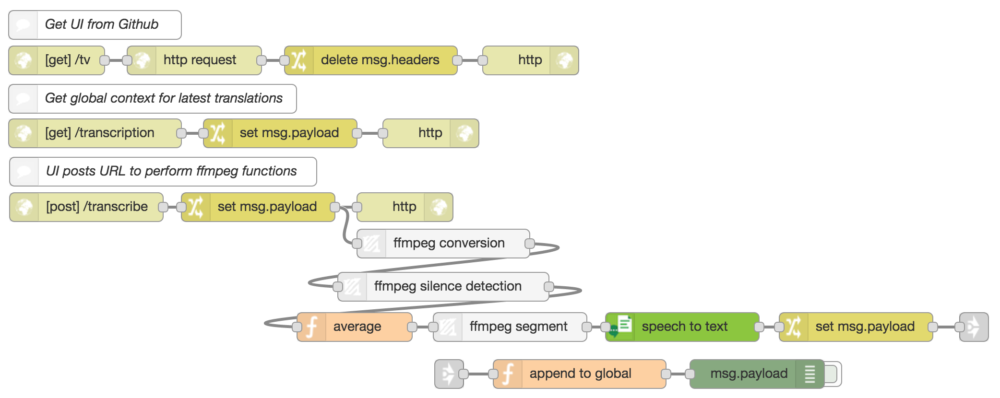
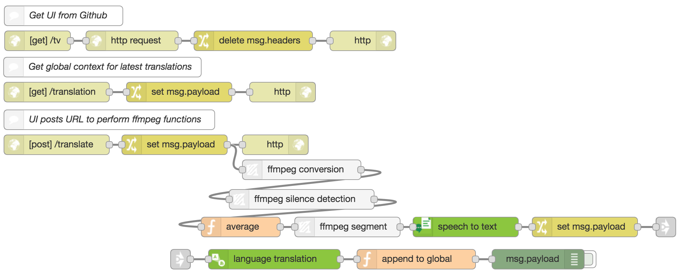

# Video Captioning
**video is waiting release**
Link to video description

## Overview
**Note:** this stater-kit will need you to allocate more memory to your node-RED instance.

Uses the <a href="https://github.com/ibm-early-programs/node-red-contrib-media-utils">FFmpeg nodes</a> (Conversion, Silence Detect and Segment) and the <a href="https://github.com/watson-developer-cloud/node-red-node-watson">Watson nodes</a> (Speech to Text and optionally Language Translation) to create live captions for a video.

The UI allows a user to load up a video file (eg. Ted Talk) and send the URL to a Node-RED flow.

Node-RED will:
* Download the video
* Convert the video into an audio buffer
* Perform silence detection on the audio
* Split the audio into sentences based on silences
* Convert audio sentence to text using Speech-to-Text
* If translating, it will translate the sentence using Language-Translation
* Save results to global context

The UI will poll the global context to receive new captions and displays them at the correct time under the video.

## Application flow

[Transcription JSON](transcription.json)

[Translation JSON](translation.json)

## Flow description

Load UI:

* `HTTP-In` *(GET)* : receives GET request on `/tv`
* `HTTP-Request` : sends GET request to Github to get HTML content
* `Change` : delete `msg.headers`
* `HTTP-Out` : send HTTP response

Node-RED Flow:

* `HTTP-In` *(POST)* : receives URL
* `Change` : set `msg.payload` to URL
* `HTTP-Out` : send HTTP response
* `FFmpeg-Conversion` : downloads video and converts it into a .wav buffer and sets it to `msg.payload`
* `FFmpeg-Silence-Detect` : performs silence detection, `msg.silences` contains the start and end times of the silences in seconds, eg. `[0, 2]` represents silence beteen 0 and 2 seconds
* `Function` : get averages for each silence duration and set the result to `msg.times`
* `FFmpeg-Segment` : splits the buffer into a series of messages at each time provided in `msg.times`, each message contains the start and end times on `msg.timesplit`
* `Speech-to-Text` : convert buffer into text
* `Change` : set `msg.payload` to `msg.transcription`
* `Link` : Links two flows for neat looking flow
* `Language-Translation` *(optional)* : converts text into French
* `Function` : push transcription/translation to `global.transcription` or `global.translation`
* `Debug` *(optional)* : log result

Poll Transcription:

* `HTTP-In` *(GET)* : receives GET request
* `Change` : set `msg.payload` to `global.transcription` or `global.translation`
* `HTTP-Out` : send HTTP reponse
